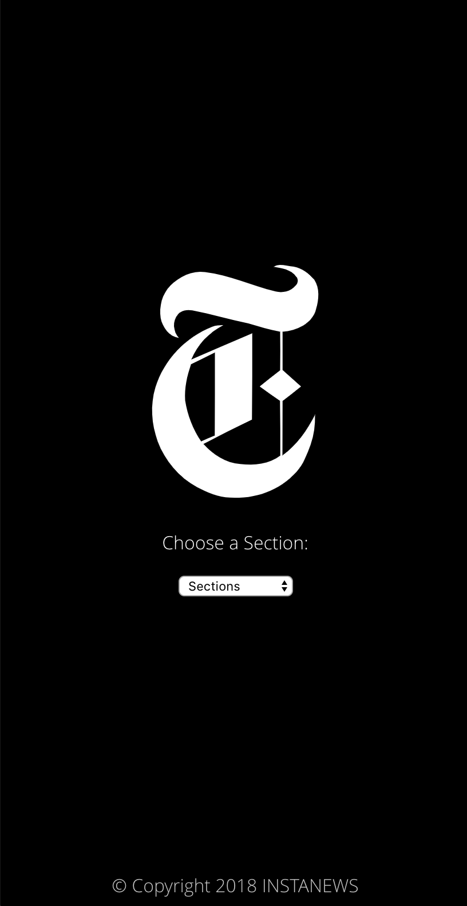
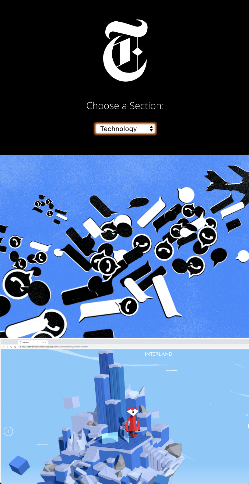
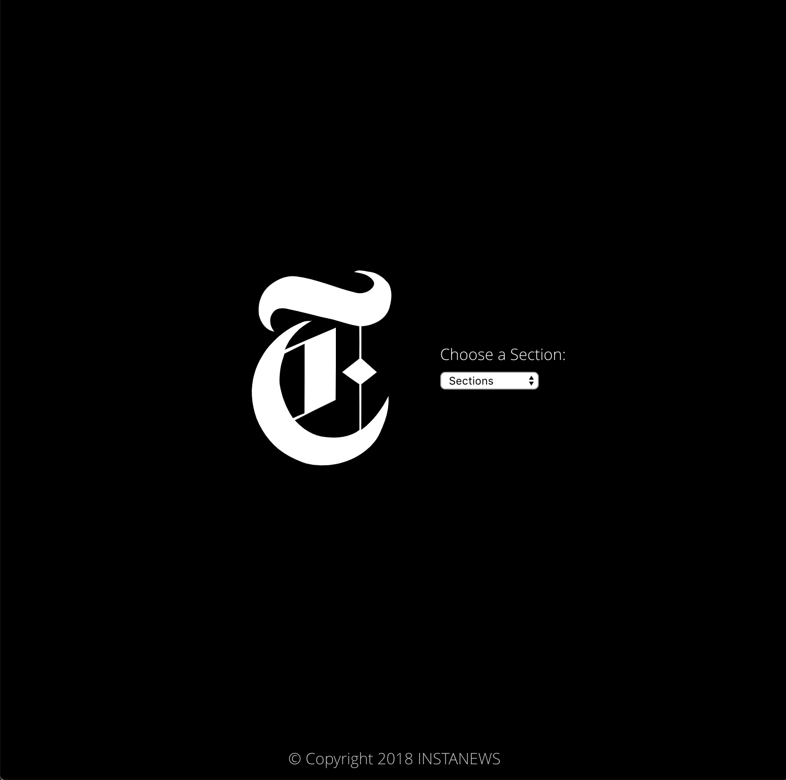
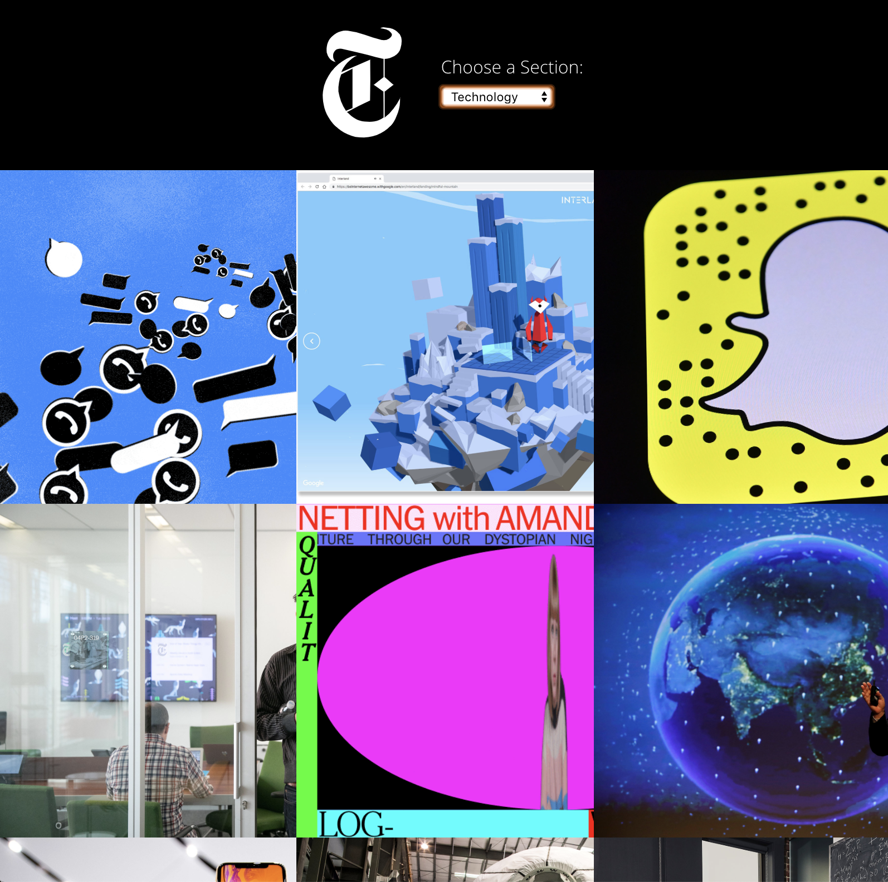

# NYT Instanews Project
 
 

---
## The Project

The project is about creating a webpage that allows the user to select different news by selecting a certain category. The content is been requested through API's from NYT website. Each category contains 12 news.
 
Following the RWD principles, three breakpoints for the website have been created:
 
- Mobile (320px)
- Tablet (600px)
- Desktop (1240px)
 
 

---
## Mobile

 

 
 

---
## Tablet

 

 
 

---
## Desktop

 

 
 

---
## Built with

- HTML5
- CSS3
- CSS Animation
- JavaScript
- jQuery
- Ajax
- Sass
- Gulp
 
 

---
## Personal Learnings

I started the project preparing the basics such as HTML and CSS first. By that I had the opportunity to practice the use of HTML and CSS elements. Also in this project I started using SASS pre-processor creating variables, fonts, mixins and partials. From using SASS I have learnt how to organise all the files in a project and its importance.
 
Using JS I managed to create effective conditionals, loops, objects and arrays working with the data provided by NYT website. Through Ajax I managed to get requests with API keys. 
 

I now have a better understanding about the whole process of creating a instanews page, using languages and tools that optimise and organise all the content, the files and the project itself.
 
 

----
## Link
You can check the final result of my project by clicking [here](https://github.com/tonypossamai/NYT-Instanews.git)
 
 
 
 
Thank you!
